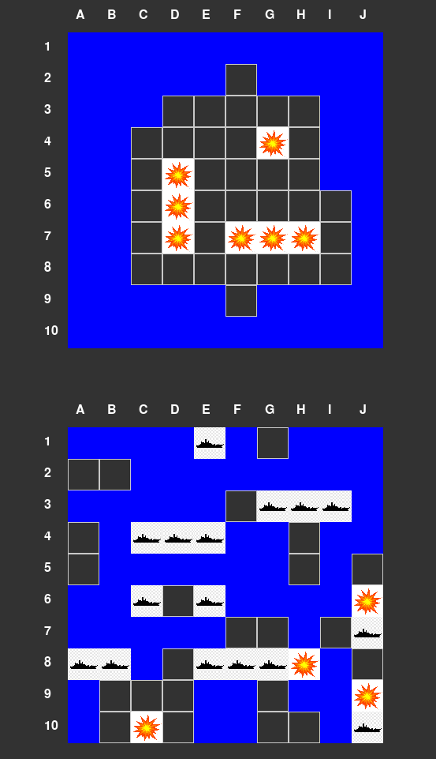

Language: [EN](https://github.com/EvansTrein/Naval-combat/blob/main/README.md), [RU](https://github.com/EvansTrein/Naval-combat/blob/main/README_RU.md)

# What it is
Realisation of the naval combat game in the simplest version.

# Why and how I did it
I wanted to make a project with a graphical interface and pygame was perfect for this + I liked this game as a kid. Also, to apply Python's OOP and work with a two-dimensional array.
I specially made all properties in all classes public, did not prescribe setters and getters, it is assumed that the interaction will be only with the window of the game itself.
*Realised feature* - if you destroy the ship completely, all its neighbouring and hidden cells will open.

# How to run
You must have python installed on your computer.
Clone the repository - install the dependencies (`pip3 install -r requirements.txt`) - open the project and type in the terminal (`python main.py`)
